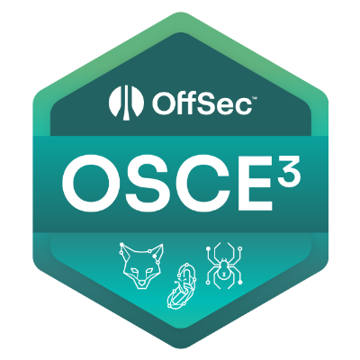
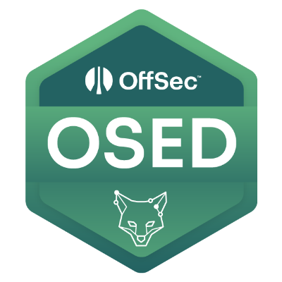
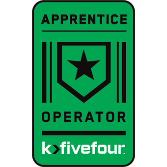
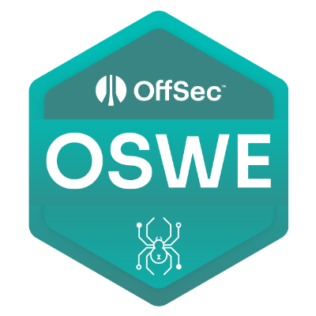
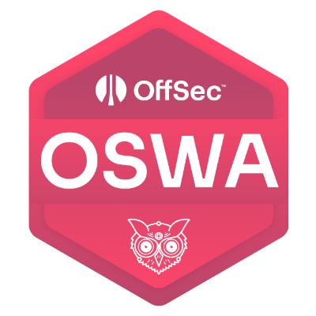
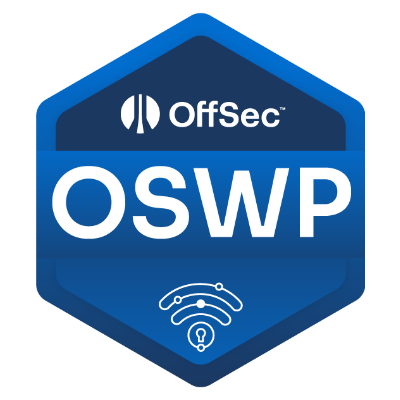
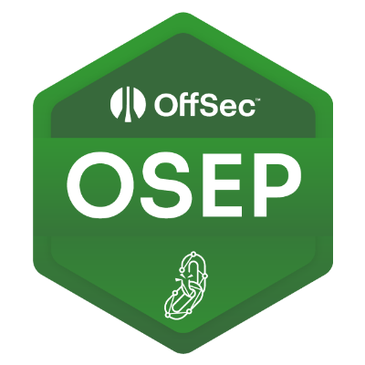
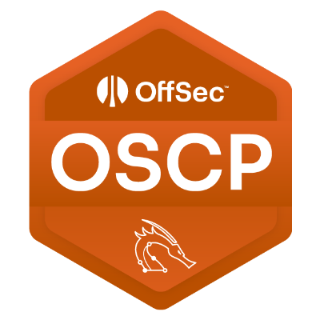

## Certificates

- [credential.net](https://www.credential.net/profile/thomasbwells/wallet)
- [credly.com](https://www.credly.com/users/thomas-b-wells/badges)

<table>
  <tr>
    <th>Abbreviated</th>
    <th>Full Name</th>
    <th>Obtained</th>
    <th>Link</th>
  </tr>
  <tr>
    <td>OSCE3</td>
	<td>Offensive Security Certified Expert 3</td>
    <td>February 3rd, 2024</td>
    <td><a href="https://www.credential.net/6756d2f2-a1d2-4d2c-83f8-7cc842d39a69">Link</a></td>
  </tr>
  <tr>
    <td>OSED</td>
	<td>Offensive Security Exploit Developer</td>
    <td>April 5th, 2023</td>
    <td><a href="https://www.credential.net/ab8fcd09-7a09-4c14-a6b0-ab678d5cdb43">Link</a></td>
  </tr>
  <tr>
    <td>RTAC</td>
	<td>k>fivefour Red Team Apprentice Certified</td>
    <td>January 27th, 2024</td>
    <td><a href="https://www.credly.com/badges/dd8ba6de-8f90-45fc-965f-04c6fedc8100">Link</a></td>
  </tr>
  <tr>
    <td>OSWE</td>
	<td>Offensive Security Web Expert</td>
    <td>August 23rd, 2023</td>
    <td><a href="https://www.credential.net/b8151f21-cd6f-46b1-bbc1-a88fb6358e80">Link</a></td>
  </tr>
  <tr>
    <td>OSWA</td>
	<td>Offensive Security Web Assessor</td>
    <td>April 25th, 2023</td>
    <td><a href="https://www.credential.net/37a3aa82-9dfc-4d9d-a143-c9afed9ca808">Link</a></td>
  </tr>
  <tr>
    <td>OSWP</td>
	<td>Offensive Security Wireless Professional</td>
    <td>April 22nd, 2023</td>
    <td><a href="https://www.credential.net/5eba12a9-5830-4859-be04-6979d9db3ec1">Link</a></td>
  </tr>
  <tr>
    <td>OSEP</td>
	<td>Offensive Security Experienced Penetration Tester</td>
    <td>March 25th, 2023</td>
    <td><a href="https://www.credential.net/2fc74f52-08f0-43cf-a4ab-1422c54c4331">Link</a></td>
  </tr>
  <tr>
    <td>OSCP</td>
	<td>Offensive Security Certified Professional</td>
    <td>February 20th, 2023</td>
    <td><a href="https://www.credential.net/2ce23116-4238-41e3-b00a-f123f6c16af7">Link</a></td>
  </tr>
  <tr>
    <td>CSIS</td>
	<td>CompTIA Securite Infrastructure Specialist (Security+, A+, Network+)</td>
    <td>August 28th, 2020</td>
    <td><a href="https://www.credly.com/badges/4daaa24d-9877-44d2-8ab8-cb09378f7814">Link</a></td>
  </tr>

</table>
